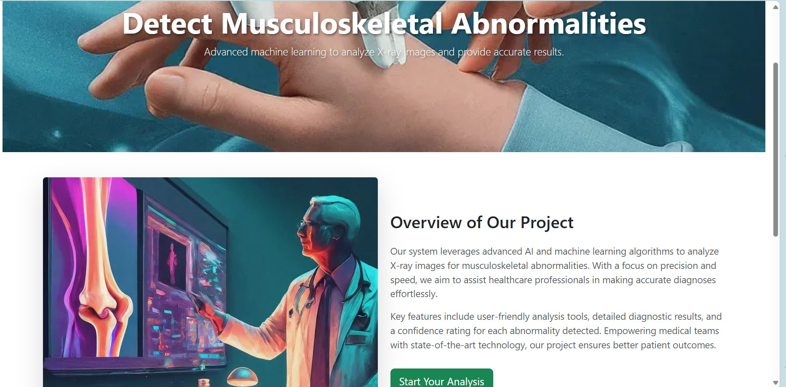
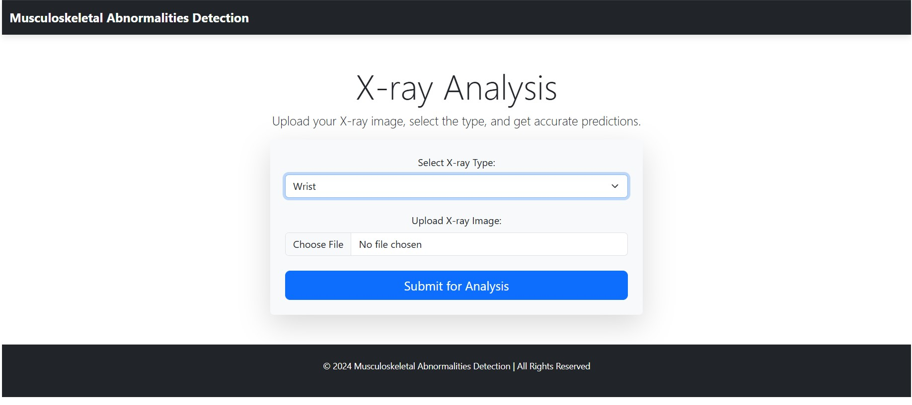

# Musculoskeletal Abnormalities Detection Using Deep Learning

This project utilizes deep learning techniques to detect abnormalities in X-ray images of various body parts, including the wrist, finger, humerus, forearm, and hand. The application is developed using **Flask** and leverages TensorFlow/Keras for model inference, offering an intuitive web-based interface for medical professionals or researchers.

  
  
<strong>Home Page of the Application</strong>

  
  
<strong>Prediction Results Page</strong>

---

## 🚀 Features

- 🩻 **X-ray Image Analysis**: Upload X-ray images and receive predictions for abnormalities with high accuracy.
- 🧠 **Pre-trained Models**: Specialized deep learning models trained on datasets for detecting abnormalities in:
  - Wrist (XR_WRIST)
  - Finger (XR_FINGER)
  - Humerus (XR_HUMERUS)
  - Forearm (XR_FOREARM)
  - Hand (XR_HAND)
- 📊 **Confidence Score**: Each prediction includes a confidence level to gauge the reliability of the result.
- 💡 **User-Friendly Interface**: Simple and responsive design for easy interaction.
- 📄 **Detailed Results Page**: Provides predictions with accompanying visual and textual feedback.

---

## 🧰 Technologies Used

### 🔧 Backend:
- **Flask** – Lightweight Python web framework.
- **TensorFlow/Keras** – Deep learning frameworks for model inference.

### 🎨 Frontend:
- **HTML, CSS, Bootstrap** – For a responsive and modern UI.

### 🖼️ Image Processing:
- **scikit-image** – Used for preprocessing and transforming medical images.

---

## 📥 Download Pretrained Models

All models used for inference in this project are hosted on Hugging Face:

👉 [**Download Model Weights Here**](https://huggingface.co/thor15/Musculoskeletal-Abnormalities-Detection-by-DL/tree/main)

> After downloading, place the model files into the `models/` directory within your project (create the directory if it doesn't exist).

---

